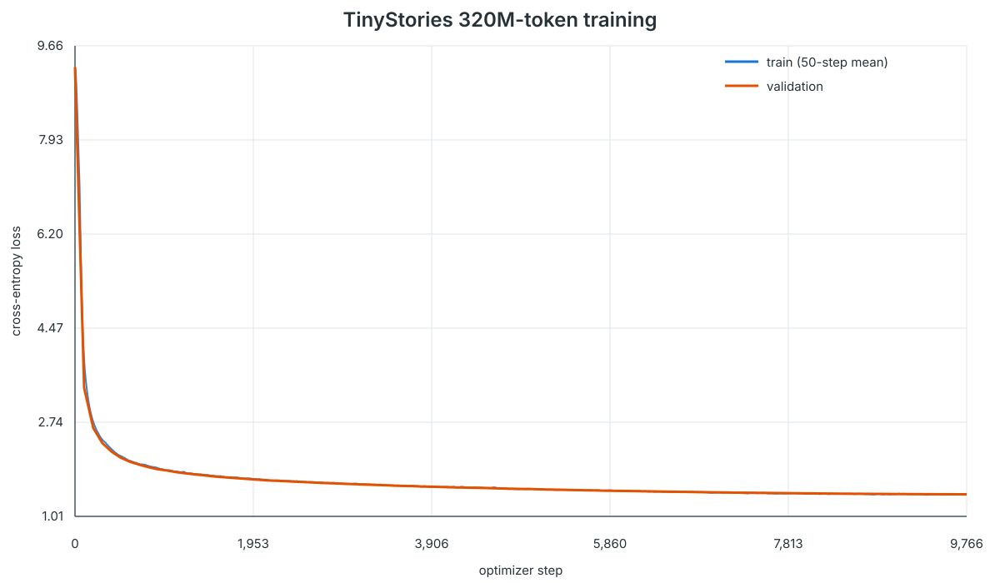
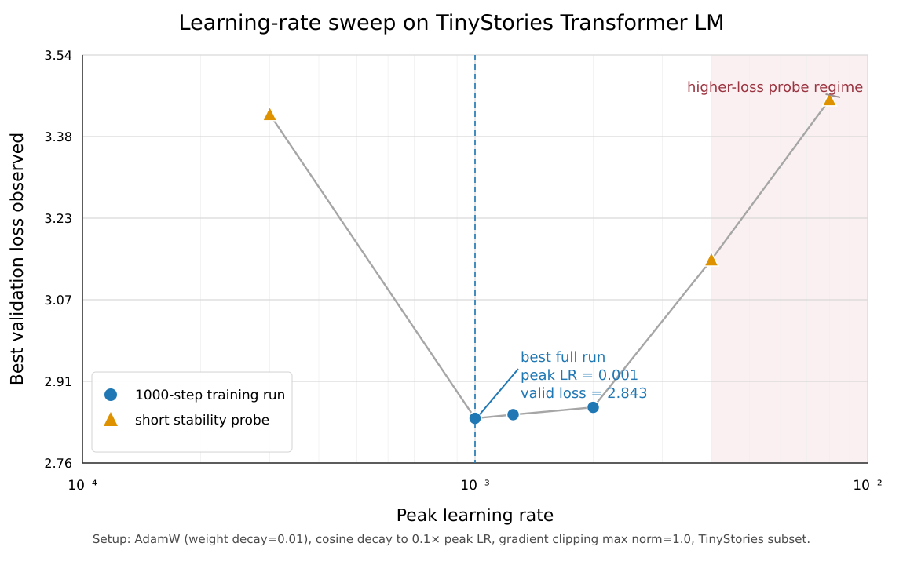

# Transformer LM From Scratch

A from-scratch GPT-style language model implementation and experimental record built on
[Stanford CS336 Assignment 1](./cs336_assignment1_basics.pdf). The repository covers the complete TinyStories
workflow: byte-level BPE training, Transformer components, optimization, checkpointing, Modal GPU training,
learning-rate selection, and decoding analysis.

## Overview

| Area | Implementation |
| --- | --- |
| Tokenization | Byte-level BPE training, special-token handling, encode/decode, streaming preprocessing |
| Model | Linear and embedding layers, RMSNorm, RoPE, causal multi-head attention, SwiGLU, Transformer LM |
| Optimization | Cross-entropy, AdamW, cosine schedule with warmup, global gradient clipping |
| Training | Memory-mapped datasets, deterministic evaluation, TensorBoard/CSV logging, resumable checkpoints |
| Infrastructure | Reproducible `uv` environment and Modal CPU/GPU launchers |
| Experiments | Learning-rate sweep, 320M-token B200 training run, Temperature/Top-k/Top-p comparison |

The current implementation passes the assignment test suite: **47 passed, 1 expected xfail**.

## Main Experiment

| Item | Setting |
| --- | --- |
| Dataset | TinyStories V2 GPT-4 |
| Tokenized training set | 541,229,347 tokens |
| Vocabulary | 10,000 byte-level BPE tokens |
| Context length | 256 |
| Model | 4 layers, `d_model=448`, 14 heads, `d_ff=1216` |
| Parameters | 18,712,512 |
| Optimizer | AdamW, betas `(0.9, 0.95)`, weight decay `0.01` |
| Schedule | 100-step warmup to `1e-3`, cosine decay to `1e-4` |
| Training budget | 9,766 steps, batch size 128, 320,012,288 tokens |
| Hardware | Single NVIDIA B200 on Modal |

## Results

| Metric | Value |
| --- | ---: |
| Initial validation loss | 9.2685 |
| Best validation loss | **1.4112** at step 9,700 |
| Final validation loss | 1.4113 |
| Last-step batch loss | 1.3376 |
| Training time | 650.46 seconds (10.8 minutes) |
| End-to-end throughput | 491,975 tokens/s |
| Peak allocated GPU memory | 13,073 MiB |
| Compact final checkpoint | 71.40 MiB |

The compact checkpoint is available at
[`experiments/tinystories_320m_d448_lr1e-3_20260902/final_model.pt`](experiments/tinystories_320m_d448_lr1e-3_20260902/final_model.pt).
The optimizer-inclusive 214.2 MiB checkpoint is retained in the Modal Volume for resuming training.

## Training Curves

### TinyStories 320M-token run

The training curve contains all 9,766 per-step train losses and 99 deterministic validation measurements.
The plotted train series uses a 50-step moving average; raw values are in
[`metrics.csv`](experiments/tinystories_320m_d448_lr1e-3_20260902/metrics.csv).



### Learning-rate sweep

The two-stage sweep first probed six learning rates and then extended the three strongest candidates.
For the deliberately small sweep subset, `1e-3` achieved the best validation loss. All extended runs began
overfitting after roughly 500 steps, so the sweep is useful for selecting a stable range rather than predicting
the absolute full-data loss.



Full sweep records: [`experiments/lr_sweep_comparison_20260902/`](experiments/lr_sweep_comparison_20260902/).

## Decoding Study

Temperature, Top-k, and Top-p were compared on 32 fixed validation prompts with three shared random seeds,
giving 96 continuations per stochastic strategy and 1,344 generated continuations overall.

| Strategy | PPL ↓ | Distinct-2 ↑ | 4-gram repetition ↓ | Balance score ↑ |
| --- | ---: | ---: | ---: | ---: |
| **`T=0.8, K=100`** | 2.60 | 86.6% | 1.6% | **94.86** |
| `T=0.8, K=50` | 2.56 | 86.3% | 1.7% | 94.78 |
| `T=0.8, P=0.90` | 2.15 | 86.0% | 1.6% | 94.67 |
| `T=0.8, P=0.50` | 1.69 | 83.0% | 3.1% | 88.13 |
| Greedy | 1.62 | 83.3% | 3.0% | 85.30 |
| `T=1.4` | 186.30 | 97.5% | 0.0% | 61.91 |

The measured default for this checkpoint is **`temperature=0.8, top_k=100`**, although the three leading
strategies are effectively tied. Greedy and low Top-p decoding are safer but more repetitive and templated.
At high temperature, diversity rises while coherence collapses: `T=1.4` produced broken grammar, token
fragments, and an EOS rate of only 9.4%. With temperature controlled at 0.8, `top_p=0.90–0.95` remained stable.

- [Full automatic comparison](experiments/decoding_strategy_comparison_20260902/comparison_table.md)
- [Side-by-side generation cases](experiments/decoding_strategy_comparison_20260902/cases.md)
- [Analysis report](experiments/decoding_strategy_comparison_20260902/report.md)

## Analysis Notes

### Optimization

The learning-rate sweep selected `1e-3` as the conservative full-training choice. The short probes also showed
why a low-budget winner should not be treated as final: `2e-3` led at the probe stage, but `1e-3` overtook it
during the extended comparison. On the full 541M-token dataset, train and validation losses continued to fall
together through almost the entire 320M-token budget, with the best validation point at step 9,700.

### Preprocessing and caching

The 2.1 GiB training corpus was encoded into 541,229,347 `uint16` token IDs in 259.71 seconds. The preprocessor
streams document-aligned chunks, verifies the fast `tiktoken` encoding against the assignment tokenizer, and
caches the binary arrays in the Modal Volume. The encoding pass was about 40% of the model-training time, so
reusing cached IDs materially speeds up later experiments.

### Generation behavior

In-distribution story prefixes produce recognizable TinyStories structure: a named character, a small problem,
and a simple resolution. Low-entropy decoding often repeats safe templates. Higher entropy improves lexical
variety, but beyond `T≈1.0` this small model rapidly loses character, causal, and grammatical consistency. The
validation loss therefore measures TinyStories distribution modeling, not instruction following or broad world
knowledge.

## Quick Start

### Environment and tests

Install [`uv`](https://docs.astral.sh/uv/) and let the checked-in lockfile create the environment:

```bash
uv sync
uv run pytest
```

Run a single test while developing:

```bash
uv run pytest tests/test_train_bpe.py::test_train_bpe
```

### Download TinyStories

```bash
mkdir -p data/raw
wget -P data/raw \
  https://huggingface.co/datasets/roneneldan/TinyStories/resolve/main/TinyStoriesV2-GPT4-train.txt
wget -P data/raw \
  https://huggingface.co/datasets/roneneldan/TinyStories/resolve/main/TinyStoriesV2-GPT4-valid.txt
```

### Interactive inference

The final checkpoint uses the 448-dimensional configuration, so pass the matching architecture explicitly:

```bash
uv run python -m cs336_basics.inference \
  --checkpoint_path experiments/tinystories_320m_d448_lr1e-3_20260902/final_model.pt \
  --tokenizer_dir data/tinystories_10k \
  --d_model 448 \
  --num_layers 4 \
  --num_heads 14 \
  --d_ff 1216 \
  --temperature 0.8 \
  --top_p 0.9
```

`top_p=0.9` is used here because the interactive inference entry point exposes Temperature and Top-p. The
separate decoding experiment also implements Top-k and found `top_k=100` marginally best.

## Modal Workflow

Create the shared Volume and upload the raw corpora once:

```bash
modal volume create cs336-assignment1-data
modal volume put cs336-assignment1-data \
  data/raw/TinyStoriesV2-GPT4-train.txt /TinyStoriesV2-GPT4-train.txt
modal volume put cs336-assignment1-data \
  data/raw/TinyStoriesV2-GPT4-valid.txt /TinyStoriesV2-GPT4-valid.txt
```

Run each stage from the repository root:

```bash
# Train the 10K BPE tokenizer.
modal run modal_bpe.py

# Verify training, checkpoint reload, and generation in 100 steps on a T4.
modal run modal_train.py

# Run the two-stage learning-rate sweep.
modal run modal_lr_sweep.py

# Stream-tokenize the full corpus and run the 320M-token B200 training job.
modal run modal_full_train.py --mode all

# Compare Temperature, Top-k, and Top-p using the final checkpoint.
modal run modal_decode_experiment.py
```

The full-training launcher is restartable. It saves optimizer-inclusive state every 1,000 steps and resumes from
`checkpoint_latest.pt` if a Modal run is interrupted. TensorBoard data can be viewed locally with:

```bash
uv run --with tensorboard tensorboard \
  --logdir experiments/tinystories_320m_d448_lr1e-3_20260902/tensorboard
```

## Repository Structure

```text
.
├── cs336_basics/
│   ├── train_bpe.py          # BPE trainer and tokenizer serialization
│   ├── tokenizer.py          # byte-level BPE encode/decode
│   ├── nn.py                 # Transformer components and generation
│   ├── losses.py             # cross-entropy
│   ├── optimizer.py          # AdamW and gradient clipping
│   ├── scheduler.py          # warmup + cosine schedule
│   ├── data.py               # random language-model batches
│   ├── checkpointing.py      # model/optimizer save and load
│   ├── main_train.py         # local command-line training loop
│   └── inference.py          # interactive text generation
├── data/tinystories_10k/     # trained vocabulary and merges
├── experiments/
│   ├── lr_sweep_comparison_20260902/
│   ├── tinystories_320m_d448_lr1e-3_20260902/
│   └── decoding_strategy_comparison_20260902/
├── modal_bpe.py              # remote tokenizer training
├── modal_train.py            # 100-step smoke test
├── modal_lr_sweep.py         # learning-rate search
├── modal_full_train.py       # full preprocessing and B200 training
├── modal_decode_experiment.py
├── tests/
├── pyproject.toml
└── uv.lock
```

## Experiment Entry Points

- [`modal_bpe.py`](modal_bpe.py): train and persist the TinyStories tokenizer.
- [`modal_train.py`](modal_train.py): validate loss reduction, checkpoint save/load, and readable sampling.
- [`modal_lr_sweep.py`](modal_lr_sweep.py): run the two-stage learning-rate comparison and produce the SVG report.
- [`modal_full_train.py`](modal_full_train.py): prepare the full dataset, train on B200, and write all artifacts.
- [`modal_decode_experiment.py`](modal_decode_experiment.py): compare sampling strategies with automatic metrics and
  side-by-side cases.
- [`experiments/`](experiments/): configs, raw metrics, checkpoints, figures, samples, and reports.

## Assignment Context

The original assignment handout is included as
[`cs336_assignment1_basics.pdf`](./cs336_assignment1_basics.pdf). This repository extends the assignment scaffold
with complete implementations, reproducible Modal launchers, and measured experiments. It is intended as an
educational implementation rather than a production language-model stack.
